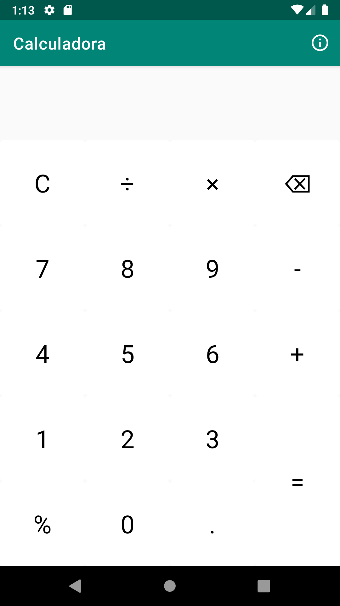
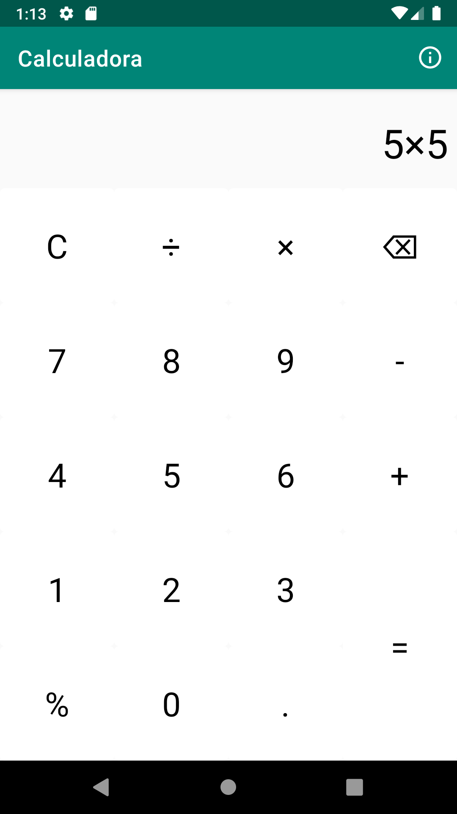
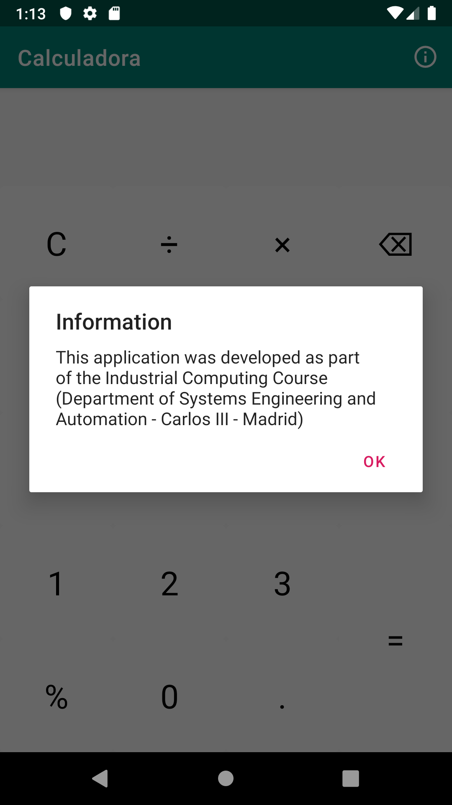

# Calculadora : simple calculator for Android.

This application was developed as part of the Industrial Computing Course (Department of Systems Engineering and Automation - Carlos III - Madrid)

  

## Screenshots

  
  
  

## Download

